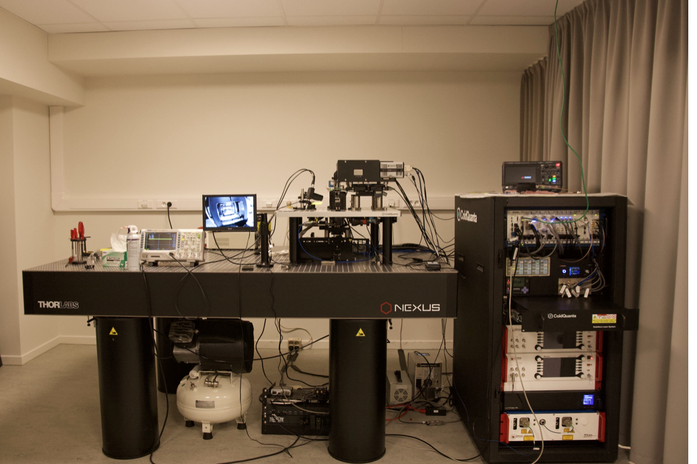
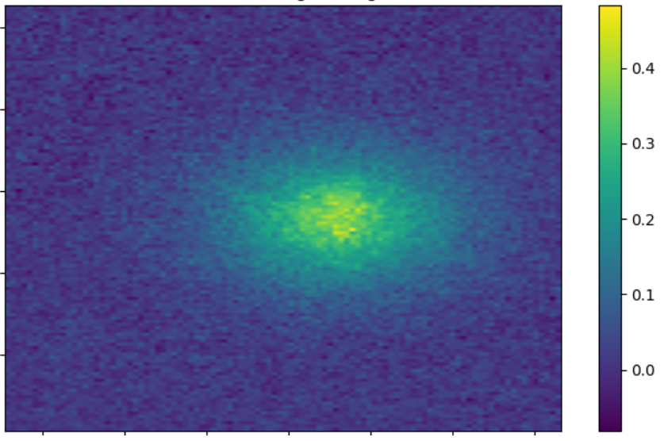

Physics is often framed as a search for the fundamental laws of the universe, and like many, I was first drawn to the field [by the search for the building blocks of our universe](https://www.nature.com/articles/nature.2012.10940). However, I soon found that the most captivating mysteries aren't just in the particles themselves, but in what happens [when you bring them together](https://cse-robotics.engr.tamu.edu/dshell/cs689/papers/anderson72more_is_different.pdf).

Encountering superfluids and superconductors for the first time during my undergraduate years shifted my entire trajectory. Watching a [fluid seep right through its container](https://www.youtube.com/watch?v=2Z6UJbwxBZI) and a [disc lock itself in empty space](https://www.youtube.com/watch?v=PXHczjOg06w) felt [magical](https://en.wikipedia.org/wiki/Clarke's_three_laws)—a moment where the quantum world stopped being an abstraction and turned into something more tangible. These are, in fact, due to the emergent behavior of large collections of particles [acting as a single, coherent entity](https://en.wikipedia.org/wiki/Bose%E2%80%93Einstein_condensate).

My research broadly focuses on bridging this gap between the individual and the collective. Using **ab initio computational methods**, I work to recreate and understand these exotic macroscopic behaviors directly from their microscopic descriptions. In doing so, I hope to not only derive more predictive power from our fundamental theories but also to find novel and practical ways to bring the benefits of the quantum world into our own.

<br>

::: {.interest-tiles}

::: {.interest-tile}
### Quantum gases
In our search for quantum-ness, we find that the world gets a lot more interesting near absolute zero. At these temperatures, dilute vapors of atoms form "quantum gases" where their wave-like nature dictates the physics in stark contrast to fluids we encounter in daily life. For bosonic species, this results in a coherent entity that exhibits wholly unclassical behavior, most notably superfluidity. Practically, we study these objects using cold atom experiments where an atomic species such as Rb87 is cooled to around 100nK and prodded with laser beams to see how the system responds. A large part of my work involves theoretically modelling and simulating these ultracold gases on a computer.

::: {layout-ncol=2}
{.lightbox group="quantum-gas" width=70%}

{.lightbox group="quantum-gas" width=70%}
:::

Additionally, over the past decade, we have made huge experimental progress in realizing and controlling these setups at increasingly lower temperatures. One can induce a variety of interactions between the atoms, manufacture an arbitrary potential landscape and even introduce multiple distinct atomic species. This unprecedented level of control motivates their usage as quantum simulators that allow us to gain insight into a wide range of unrelated physical systems ranging from solid state physics to cosmology. I generally enjoy collaborating with experimentalists to explore new realizations of such simulators as well.
:::

::: {.interest-tile}
### Computational quantum many-body physics
When describing systems involving thousands of particles, one often writes down an effective field theory that captures the essential features of the physics while maintaining analytical tractability. I focus instead on ab initio descriptions where we work with the full microscopic Hamiltonian. These systems generally have no exact solution for more than two particles (excluding [integrable systems](https://en.wikipedia.org/wiki/Bethe_ansatz), which serve as our benchmarks). In these cases, we instead turn to smartly engineered numerical algorithms to solve the problem for a specified set of parameters on a computer. One may argue whether such solutions constitute genuine "understanding", so it is important to complement them with effective theories and other frameworks to truly gain predictive insight. Most of my experience is with (path integral-) quantum Monte Carlo methods and tensor network algorithms for many-body systems.

```{=html}
<div style="margin: 3rem 0; display: flex; gap: 20px; align-items: flex-start;">
  <div style="flex: 1.33; display: flex; flex-direction: column;">
    <video controls muted style="width: 100%; border-radius: 12px; border: 1.5px solid #adb5bd;">
      <source src="images/research/tdse_wavepacket.mp4" type="video/mp4">
    </video>
    <div style="text-align: center; font-size: 0.9rem; color: #6c757d; margin-top: 8px;">
      Real time evolution of a quantum wave-packet in 1D.
    </div>
  </div>

  <div style="flex: 2; display: flex; flex-direction: column;">
    <video controls muted style="width: 100%; border-radius: 12px; border: 1.5px solid #adb5bd;">
      <source src="images/research/gpe_imag_time.mp4" type="video/mp4">
    </video>
    <div style="text-align: center; font-size: 0.9rem; color: #6c757d; margin-top: 8px;">
      Imaginary time evolution of a Bose-Einstein condensate in 1D.
    </div>
  </div>

</div>
```

I also believe that numerical methods are only as good as their accessibility to other practitioners. As a result, my work also involves building performant and [open source numerical packages](projects.qmd#research-software) that implement these algorithms.
:::

::: {.interest-tile}
### Tensor Networks
Suppose we would like to find the ground state of some Hamiltonian with an inherent discrete label (e.g., a lattice structure):
$$
|\Psi\rangle = \sum C_{n_1, n_2, \dots, n_L} \, |n_1, n_2, \dots, n_L\rangle,
$$
where $\{|n_1, n_2, \dots, n_L\rangle\}$ is some natural many-body basis such that each index can take $d$ values (for e.g, $d=2$ for a spin-$1/2$ model). A primary difficulty arises in even representing this state on a computer, since the coefficient tensor $C$ contains exponentially many entries ($\sim d^L$), thereby limiting us to small system sizes $L$. It turns out to be useful to decompose $C$ with a sequence of singular value decompositions as follows:

```{=html}
<div style="display: flex; justify-content: center; margin: 2rem 0; width: 100%;">
  <div style="overflow-x: auto;">
    <script type="text/tikz">
  \begin{tikzpicture}[
    tensor/.style={rectangle, draw, thick, fill=blue!5, rounded corners, minimum width=1.2cm, minimum height=0.9cm, font=\small},
    node distance=2.2cm,
    >=stealth
  ]

    % Equation Prefix
    \node (EQ) at (-2.8, 0) {\large $C_{n_1, \dots, n_L} = $};

    % Left side tensors
    \node[tensor] (C1) at (0,0) {$C^{(1)}$};
    \node[tensor] (C2) [right of=C1] {$C^{(2)}$};
    \node[tensor] (C3) [right of=C2] {$C^{(3)}$};
    
    % Ellipsis
    \node (dots) [right of=C3, xshift=-0.2cm] {$\cdots$};

    % Right side tensors
    \node[tensor] (CL2) [right of=dots, xshift=-0.2cm] {$C^{(L-2)}$};
    \node[tensor] (CL1) [right of=CL2] {$C^{(L-1)}$};
    \node[tensor] (CL) [right of=CL1] {$C^{(L)}$};

    % Physical indices (legs pointing down)
    \draw[thick] (C1.south) -- +(0,-0.6) node[below] {$n_1$};
    \draw[thick] (C2.south) -- +(0,-0.6) node[below] {$n_2$};
    \draw[thick] (C3.south) -- +(0,-0.6) node[below] {$n_3$};
    \draw[thick] (CL2.south) -- +(0,-0.6) node[below] {$n_{L-2}$};
    \draw[thick] (CL1.south) -- +(0,-0.6) node[below] {$n_{L-1}$};
    \draw[thick] (CL.south) -- +(0,-0.6) node[below] {$n_L$};

    % Virtual bonds (horizontal)
    \draw[thick] (C1.east) -- (C2.west);
    \draw[thick] (C2.east) -- (C3.west);
    \draw[thick] (C3.east) -- (dots.west);
    \draw[thick] (dots.east) -- (CL2.west);
    \draw[thick] (CL2.east) -- (CL1.west);
    \draw[thick] (CL1.east) -- (CL.west);

    % Bond Dimension Growth Labels
    \begin{scope}[font=\footnotesize, color=darkgray]
      \node at (1.1, 0.3) {$d$};
      \node at (3.3, 0.3) {$d^2$};
      \node at (5.5, 0.3) {$d^3$};

      \node at (7.2, 0.3) {$d^3$};
      \node at (9.4, 0.3) {$d^2$};
      \node at (11.6, 0.3) {$d$};
    \end{scope}

  \end{tikzpicture}
</script>
  </div>
</div>
```

Here we use a [common diagrammatic notation](https://arxiv.org/abs/1603.03039) where lines between two tensors indicate a contraction (i.e., a summation over indices) and the free legs represent physical indices. The exponential growth is indicated by the growing dimension of the contracted "virtual" indices through the chain. The ingenuity of tensor network methods arises from the observation that the ground states of a large class of physically relevant Hamiltonians obey an [area law of entanglement entropy](https://arxiv.org/abs/0808.3773), thereby possessing additional structure that we may exploit. In fact, this directly implies that the ground state can be accurately captured even if we truncate the virtual index dimensions to some constant $D$, thereby removing the exponential scaling. This constitutes the **[matrix product state](https://arxiv.org/abs/2606.24803) (MPS)** variational ansatz which has seen enormous success in describing 1D lattice models. It also has the unique advantage of not running into sign problems, as often encountered in Quantum Monte Carlo.

<div style="margin-top: 1.5rem;"></div>

Tensor network research typically involves finding novel ways to work with this ansatz (and higher dimensional generalizations) to capture the physics of a larger variety of systems. In my work, I focus mostly on *extending these methods to non-relativistic field theories*; i.e., models that live in the continuum without an obvious discrete lattice structure such as quantum gases in a trap.
:::

:::

---

::: {.project-section}
## Master's thesis

::: {.pub-list}
::: {.pub-row}

::: {.pub-image-small}
{.lightbox}
:::

::: {.pub-info-compact}
#### Low-temperature phases of interacting bosons in a lattice
supervised by Prof. Sanjeev Kumar, and Prof. Tilman Pfau

In this thesis, we explore the phase diagram arising from interacting bosons in a lattice at absolute zero temperatures. Using a large variety of numerical tools like exact diagonalization, self-consistent mean-field theories, cluster mean-field theories, stochastic series expansions, and neural quantum states, we attempt to characterize and capture the quantum phases arising due to dipolar interactions between the atoms. During this thesis, I also spent a few months with the [Dysprosium group](https://www.pi5.uni-stuttgart.de/research/dipolar-quantum-gases/) at the University of Stuttgart where I saw my first cold atom experiment.

::: {.pub-links}
[PDF](images/misc/MS18117_PRJ502.pdf)
[Code](https://github.com/20akshay00/MSThesis)
:::
:::

:::
:::
:::

---

::: {.project-section}
## Publications & Preprints

::: {.pub-list}
::: {.pub-row}

::: {.pub-image-small}
{.lightbox}
:::

::: {.pub-info-compact}
#### Finite-Element Matrix Product States for Continuum Models in One Dimension
**Akshay Shankar**, Karel Van Acoleyen, and Jutho Haegeman  
*[arXiv:2606.14873](https://arxiv.org/abs/2606.14873) [quant-ph, cond-mat.quant-gas]* (2026)

In an attempt to explore alternate ways to utilize MPS for continuum models, we consider a single particle basis expansion in terms of piecewise linear finite element orbitals. Although this basis has strictly local support, it loses orthogonality which is a key assumption in standard DMRG implementations. In this work, we extend the framework of MPS for usage with non-orthogonal basis sets and study the properties of a finite element expansion in comparison to the standard finite differences for a Lieb-Liniger gas.

::: {.pub-links}
[PDF](https://arxiv.org/pdf/2606.14873.pdf)
[Code](https://github.com/20akshay00/TentMPSAnalysis)
[Zenodo](https://zenodo.org/records/20600026)
:::
:::

:::
:::
:::