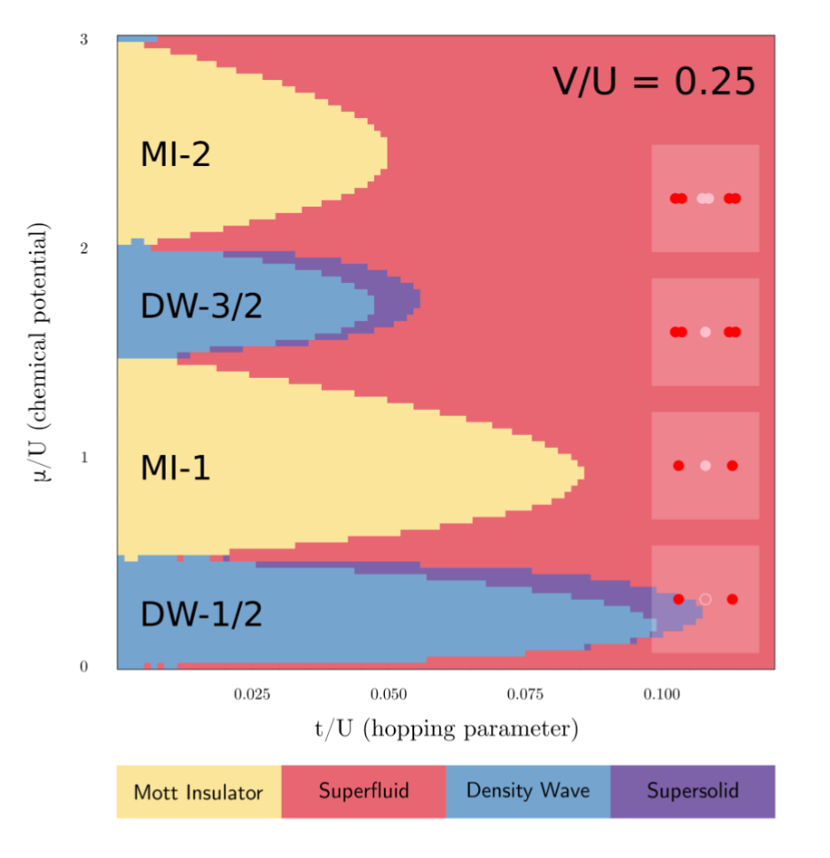
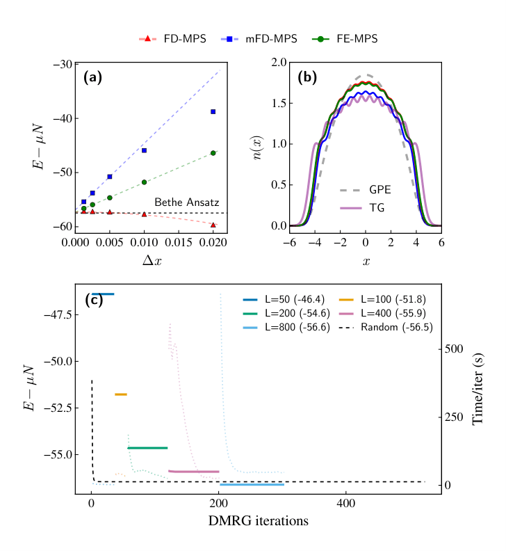

My research focuses on the intersection of quantum many-body physics and computational methods. I am particularly interested in how we can use the structure of entanglement to simulate systems that exist in the continuum, rather than on a lattice.

 

::: {.interest-tiles}

::: {.interest-tile}
### Tensor Networks for Continuum Systems
Traditional tensor network methods like MPS and PEPS were designed for lattice models. However, many physical systems—from cold atoms to high-energy fields—live in the continuum. I work on developing algorithms that leverage finite-element bases and continuous MPS to simulate these systems without the discretization errors typical of lattice approximations. This involves exploring [placeholder for specific technical detail].
:::

::: {.interest-tile}
### Bose-Einstein Condensates & Cold Atoms
One-dimensional quantum gases provide a unique playground for testing many-body theory. I am interested in the non-equilibrium dynamics of BECs, specifically how they thermalize (or fail to thermalize) and how we can capture their long-time evolution. My work involves [placeholder for detail about specific models like Lieb-Liniger].
:::

::: {.interest-tile}
### Scientific Software & Simulation
I believe that numerical methods are only as good as their accessibility. A large part of my work involves building robust, high-performance Julia packages that implement these complex tensor network algorithms. By creating bridges between abstract theory and usable code, I aim to enable [placeholder for detail about experimental collaboration].
:::

:::

---

::: {.project-section}
## Master's thesis

::: {.pub-list}

::: {.pub-row}
::: {.pub-image-small}
{.lightbox}
:::

::: {.pub-info-compact}
#### Low-temperature phases of interacting bosons in a lattice

supervised by Prof. Sanjeev Kumar, and Prof. Tilman Pfau

We combined Finite Elements with Tensor Networks to simulate 1D quantum gases significantly faster than traditional methods, effectively bridging the gap between lattice and continuum simulations. This approach allows us to directly access continuum limit observables without massive grid overheads.

::: {.pub-links}
[PDF](images/misc/MS18117_PRJ502.pdf)
[Code](https://github.com/20akshay00/MSThesis)
:::
:::
:::
:::
:::

---

::: {.project-section}
## Publications & Preprints

::: {.pub-list}

::: {.pub-row}
::: {.pub-image-small}
{.lightbox}
:::

::: {.pub-info-compact}
#### Finite-Element Matrix Product States for Continuum Models in One Dimension

**Akshay Shankar**, Karel Van Acoleyen, and Jutho Haegeman  
*[arXiv:2606.14873](https://arxiv.org/abs/2606.14873) [quant-ph, cond-mat.quant-gas]* (2026)

We combined Finite Elements with Tensor Networks to simulate 1D quantum gases significantly faster than traditional methods, effectively bridging the gap between lattice and continuum simulations. This approach allows us to directly access continuum limit observables without massive grid overheads.

::: {.pub-links}
[PDF](https://arxiv.org/pdf/2606.14873.pdf)
[Code](https://github.com/20akshay00/TentMPSAnalysis)
[Zenodo](https://zenodo.org/records/20600026)
:::
:::
:::

<!-- Add future publications here using the exact same format -->

:::
:::